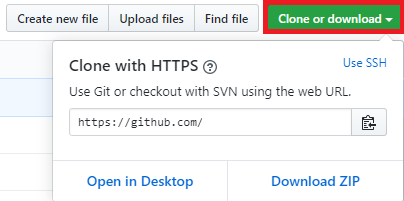

---
title: Github repository와 컴퓨터 local folder 연결하기
categories: programming
tags: Github, Git
---

## 요약
$ git remote add origin [git repository 주소]

<!-- more -->

# Github repository와 컴퓨터 local folder 연결하기

## 방법
1. git 명령어를 쓸 수 있는 커맨드창(ex. Git bash, 환경변수 등록된 상태에서 윈도우 커맨드 창 등등) 열기
2. Github repository를 연결할 폴더로 이동(cd 명령어 사용)
3. 해당 폴더에서 Git 초기화 
$ git init
4. 폴더와 repository 연결 
$ git remote add origin https://주소 
- repository 주소는 녹색 버튼(Clone or download) 누르면 확인 가능 

5. 연결되었는지 확인(1) 
$ git pull origin master 
repository에서 local folder로 파일들을 가져오는 명령어
6. 연결되었는지 확인(2) 
$ git add test.md 
$ git commit -am "new"  
$ git push origin master 
local folder의 변경사항을 repository에 적용시킴

